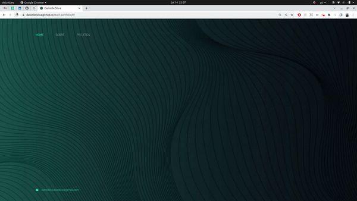
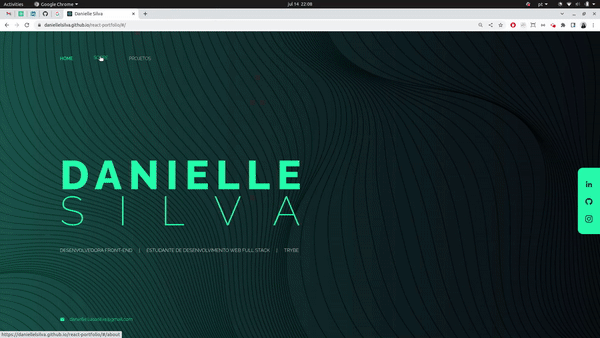

<h3>Bem-vindo(a) ao meu portfólio!</h3>

Como desenvolvedroa front-end, decidi criar um portfólio para mostrar alguns dos meus projetos, tecnologias que domino e também falo um pouco sobre mim e minhas experiências. Todo o projeto foi feito utilizando as seguintes tecnologias:

- ReactJS
- Javascript
- CSS/SASS

Inicialmente criei a página home, com algumas informações básicas sobre mim e links de acesso para redes sociais:

  

 

Na página "sobre" você encontrará algumas informações sobre mim, qual área atuo, quais tecnologias tenho contato/experiência e um pouco sobre minha histŕia

  

 

Já na página de projetos, que particularmente é minha parte favorita, você irá encontrar alguns dos projetos que já criei, optei por deixar meus projetos de mais orgulho e também os projetos iniciais, acredito que demonstrem de forma interessante a evolução que tive com o passar do tempo no curso da Trybe.

Cada projeto é apresentado em um card onde o usuário tem acesso as seguintes informações:
- Uma modal contém um vídeo exemplificando como a aplicação pode ser usada e dados importantes como o objetivo do projeto e tecnologias usadas;
- Ao repositório do projeto no GitHub;
- Acesso a aplicação em funcionamento, possibilitando que o usuário tenha uma experiência interativa com o projeto

  

 

Além disso, o portfólio é responsivo, visando entregar uma boa experiência para usuários em diversos dispositivos.

  

 

<h4>Espero que tenha gostado, e se tiver alguma sugestão, vou adorar ouvir sua opinião!!</h4> 
